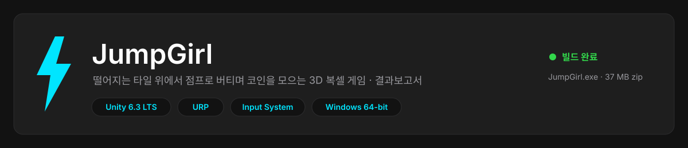
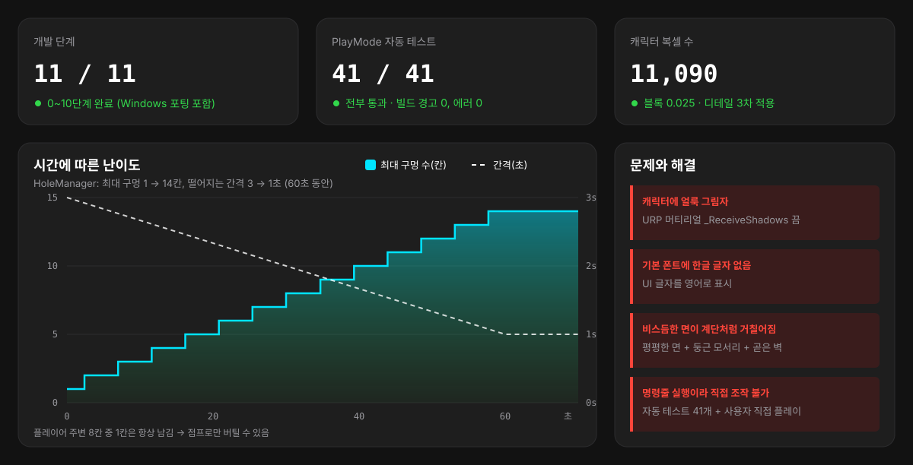

<p align="center"></p>

# JumpGirl — 결과보고서

> 4×4 타일이 하나씩 흔들리다 떨어지는 맵 위에서 **점프로 버티며 코인을 모으는** 3D 복셀 게임입니다.
> Unity 6.3 LTS(URP)로 만들었고, 캐릭터·맵·애니메이션·UI를 모두 **에디터 스크립트로 생성**했습니다.

## 한눈에 보기

<p align="center"></p>

| 항목 | 결과 |
|---|---|
| 개발 단계 | **0~10단계 완료** (Windows 포팅 포함) |
| 자동 테스트 | PlayMode **41개 모두 통과** |
| Windows 빌드 | `JumpGirl.exe` 64비트, 경고 0 · 에러 0, 배포 zip 37 MB |
| 캐릭터 | 한복풍 여자 캐릭터, 복셀 **11,090개** (블록 0.025) |
| 기간 | 2026-09-29 |

---

## 1. 게임 소개

<table>
  <tr>
    <td align="center"><br><b>메인 메뉴</b></td>
    <td align="center"><br><b>플레이 중</b></td>
    <td align="center"><br><b>게임 오버</b></td>
  </tr>
</table>

### 규칙
- 타일이 **흔들리다(1초) 떨어지고**, 잠시 뒤 아래에서 다시 올라옵니다.
- 떨어지는 간격은 **3초 → 1초**, 동시에 비어 있는 칸은 **1 → 14칸**으로 1분에 걸쳐 늘어납니다.
- 캐릭터 주변 8칸 중 **최소 1칸은 항상 남아** 있어, 점프로 옮겨 가면 버틸 수 있습니다.
- 코인은 1.5초마다 빈 칸에 생기고 **3초 뒤 사라집니다**.
  - 0~2초: 금색, **100점**
  - 2~3초: 회색으로 깜빡임, 0점
- 떨어지면(`y < -5`) 게임 오버입니다. 최고 점수는 저장되고, 기록을 넘으면 **NEW BEST!** 가 뜹니다.

### 조작
| 키 | 동작 |
|---|---|
| `W A S D` / 방향키 | 이동 |
| `Space` | 점프 |
| 마우스 클릭 / 방향키 + `Enter` | 메뉴 버튼 (START · RETRY · MAIN MENU · QUIT) |
| `Alt + Enter` | 전체 화면 ↔ 창 모드 |

<table>
  <tr>
    <td align="center"><br>금색 코인 (100점)</td>
    <td align="center"><br>회색 코인 (0점)</td>
    <td align="center"><br>4×4 맵</td>
  </tr>
</table>

## 2. Windows에서 실행하기

> [!NOTE]
> 빌드 결과물(약 100 MB)은 용량 때문에 저장소에 올리지 않습니다. 아래 방법으로 직접 만들 수 있습니다.

1. Unity **6000.3.25f1**로 프로젝트를 엽니다.
2. 메뉴 **Tools → Voxel → Build Windows**를 누릅니다.
3. 결과가 만들어집니다.
   - `Builds/Windows/JumpGirl.exe` — 바로 실행
   - `Builds/JumpGirl_Windows.zip` — 다른 PC에 보낼 때 (압축을 풀고 `JumpGirl.exe` 실행)

명령줄로 빌드할 때:

```powershell
& "C:\Program Files\Unity\Hub\Editor\6000.3.25f1\Editor\Unity.exe" -batchmode -projectPath . -executeMethod WindowsBuilder.BuildFromCommandLine -logFile build.log
```

| 설정 | 값 |
|---|---|
| 대상 | Windows 64비트 (`StandaloneWindows64`) |
| 스크립트 실행 방식 | Mono (IL2CPP 모듈이 설치되어 있지 않음) |
| 화면 | 창 없는 전체 화면, 모니터 해상도 |

## 3. 캐릭터

ChatGPT(Codex)로 만든 참고 그림을 보고, 0.025 크기 블록으로 다시 쌓았습니다. 쌓는 코드는 [`DetailedCharacterBuilder.cs`](Assets/Editor/DetailedCharacterBuilder.cs)에 있습니다.

<table>
  <tr>
    <td align="center"><br>참고 그림 (Codex)</td>
    <td align="center"><br>앞</td>
    <td align="center"><br>옆</td>
    <td align="center"><br>뒤</td>
  </tr>
</table>

| 차수 | 방식 | 결과 |
|---|---|---|
| 1차 | 0.05 상자 | 투박함 |
| 2차 | 0.025 곡면 | 비스듬한 면이 계단처럼 지저분함 |
| **3차 (적용)** | 0.025, 평평한 면 + 둥근 모서리 + 곧은 벽 | 복셀 11,090개, 색마다 서브메시 1개, 보이는 면만 생성 |

애니메이션 3개(Idle · Walk · Jump)도 스크립트로 만들었습니다.

<table>
  <tr>
    <td align="center"><br>Idle (숨쉬기)</td>
    <td align="center"><br>Walk (팔·다리 스윙)</td>
    <td align="center"><br>Jump (팔 올리기 + 몸 늘이기)</td>
  </tr>
</table>

## 4. 단계별 결과

| 단계 | 내용 | 커밋 |
|---|---|---|
| 0 | Unity 6.3 LTS · URP(Universal 3D) · Input System 프로젝트 생성 | `2ce8a49` |
| 1 | 복셀 캐릭터 → 한복풍 여자 캐릭터로 교체 | `fae80da` `699cd3e` |
| 2 | 4×4 타일맵, 이동·점프(Rigidbody), 쿼터뷰 카메라 | `780d5b2` |
| 3 | Idle / Walk / Jump 애니메이션 | `25e6b2c` |
| 4 | 금화 아이템, 획득 UI | `72fb3f3` |
| 5 | GAME OVER / CLEAR 판정 | `0adefcf` |
| 6 | 3초 카운트다운 재시작 | `16f2d2f` |
| 7 | **규칙 변경**: 점수, 움직이는 구멍, 코인 생성·소멸, 최고 점수 | `b1d392d` |
| 8 | 디테일 캐릭터(11,090 복셀), 카메라 25% 가까이 | `c94b33c` |
| 9 | UI: 메인 메뉴(JumpGirl) · 게임 오버 버튼 (자동 재시작 제거) | `5a5dcab` |
| 10 | Windows 포팅 + 결과보고서 | 이 커밋 |

## 5. 계획 대비 주요 변경

| 원래 계획 | 실제 | 이유 |
|---|---|---|
| 고정 금화 3개를 모으면 CLEAR | 끝없이 버티며 점수 쌓기 (CLEAR 없음) | 사용자 요청으로 규칙 변경 (7단계) |
| 게임 오버 3초 뒤 자동 재시작 | RETRY / MAIN MENU / QUIT 버튼 | 사용자 요청 (9단계) |
| UI 글자 한글 (`아이템 0 / 3`) | 영어 (`SCORE`, `BEST`) | 기본 폰트에 한글 글자가 없음, 폰트 추가는 하지 않기로 함 |
| Jump: 다리 모으기 | 팔 올리기 + 몸 늘이기 | 발목 치마에 다리가 가려짐 |
| 플레이어 뒤쪽 위 카메라 | 고정 각도 쿼터뷰 | 조작이 직관적 (W = 화면 위) |
| URP 빈 템플릿 | Universal 3D 템플릿 | 6.3 LTS에 URP 빈 템플릿이 없음 |

전체 목록(근거·이유·구분)은 [할일 목록.md](할일%20목록.md#계획-대비-변경-사항)에 있습니다.

## 6. 문제와 해결

> [!CAUTION]
> **캐릭터 몸에 얼룩덜룩한 그림자** — URP는 `MeshRenderer.receiveShadows`를 무시합니다.
> → 캐릭터 머티리얼에서 `_ReceiveShadows = 0`, 키워드 `_RECEIVE_SHADOWS_OFF`를 켜서 해결했습니다.

> [!CAUTION]
> **UI 한글이 네모로 깨짐** — TextMeshPro 기본 폰트(LiberationSans)에 한글이 없습니다.
> → UI 글자를 영어로 쓰기로 결정했습니다.

> [!CAUTION]
> **디테일 캐릭터 2차가 지저분함** — 비스듬한 곡면을 작은 블록으로 쌓으면 계단 모양이 생깁니다.
> → 평평한 면, 둥근 모서리, 곧은 벽으로 모양을 다시 짰습니다 (3차).

> [!CAUTION]
> **직접 조작으로 확인할 수 없음** — Unity를 명령줄(배치 모드)로만 실행할 수 있습니다.
> → 가상 키보드 입력을 넣는 PlayMode 테스트 41개로 확인하고, 동작 확인 항목은 사용자가 직접 플레이한 뒤 체크했습니다.

> [!CAUTION]
> **Overlay UI가 스크린샷에 안 찍힘** — Screen Space Overlay 캔버스는 `Camera.Render`에 찍히지 않습니다.
> → 캡처할 때만 잠시 Screen Space Camera로 바꿔서 찍습니다.

## 7. 테스트

`Assets/Tests/PlayMode` — PlayMode 테스트 **41개 모두 통과**

| 테스트 | 개수 | 확인하는 것 |
|---|---:|---|
| `PlayerMovementTests` | 8 | 이동·회전, 점프 높이 1.2칸, 맵 밖·구멍 낙하, 구멍 점프, 카메라 |
| `PlayerAnimationTests` | 4 | Idle · Walk · Jump 전환, 점프 없이 떨어질 때 Jump |
| `ItemTests` | 6 | 코인 생성 간격·위치, 100점, 회색 0점, 사라짐, 함께 떨어짐 |
| `HoleTests` | 8 | 흔들림·떨어짐·다시 생김, 난이도, 주변 1칸 남기기 |
| `GameFlowTests` | 7 | 게임 오버, 점수·최고 점수, NEW BEST!, 카메라 멈춤 |
| `RestartTests` | 4 | 자동 재시작 없음, RETRY, MAIN MENU, QUIT |
| `MainMenuTests` | 4 | START 전 멈춤, START, QUIT |

## 8. 프로젝트 구조

```
Assets/
  Scripts/        GameManager, PlayerController, FollowCamera, HoleManager,
                  CoinSpawner, Tile, Item, UIManager   (Game.asmdef)
  Editor/         DetailedCharacterBuilder, VoxelCharacterBuilder, LevelBuilder,
                  AnimationBuilder, ItemBuilder, PreviewCapture, WindowsBuilder
  Tests/PlayMode/ PlayMode 테스트 41개
  Scenes/Main.unity
Docs/images/      README 이미지 (SVG 배너·대시보드, 스크린샷)
GeneratedImages/  Codex로 만든 참고 그림
```

에디터 메뉴 **Tools → Voxel**에서 캐릭터 · 맵 · 애니메이션 · 아이템 · Windows 빌드를 한 번에 다시 만들 수 있습니다.

## 9. 문서

| 문서 | 내용 |
|---|---|
| [Unity 3D 게임 개발 계획서.md](Unity%203D%20게임%20개발%20계획서.md) | 계획과 변경 이력 (v1~v10) |
| [할일 목록.md](할일%20목록.md) | 단계별 체크리스트, 계획 대비 변경 사항 |
| [개발 일지.md](개발%20일지.md) | 한 일, 결정, 문제와 해결, 커밋 |
| [캐릭터 미리보기 (디테일).html](캐릭터%20미리보기%20(디테일).html) | 브라우저에서 돌려 보는 3D 캐릭터 |
| [UI 미리보기.html](UI%20미리보기.html) | UI 목업 |

## 남은 확인

> [!WARNING]
> - [ ] `JumpGirl.exe`를 직접 실행해 전체 화면 · 버튼 · QUIT 종료 확인
> - [ ] Unity 콘솔에 에러 / 경고가 없는지 확인

---

<sub>README 디자인: 첨부 디자인 가이드(WattVision DESIGN.md)의 색(#121212 · #1E1E1E · #00E5FF · #32D74B · #FF453A), 16px 둥근 카드, 12칸 그리드(KPI 3개 → 그래프 8칸 + 알림 4칸)를 SVG로 반영했습니다.</sub>
